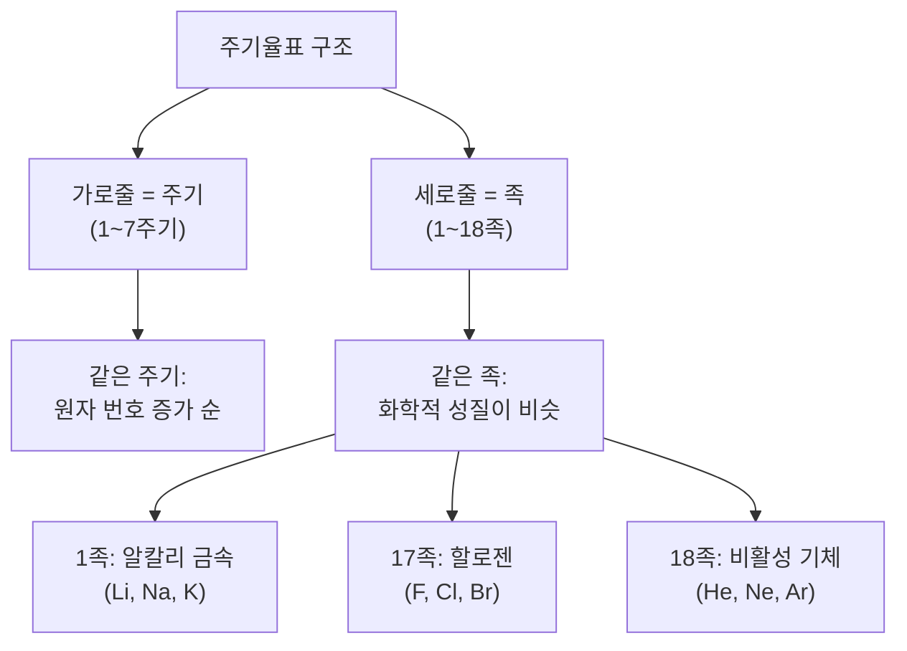

# 원소와 주기율표

## 생각 열기

> 불꽃놀이를 본 적이 있나요? 밤하늘에 빨간색, 초록색, 파란색 불꽃이 피어오릅니다. 이 색깔들은 어떻게 만들어지는 걸까요?

> [사진] 다양한 색의 불꽃이 밤하늘을 수놓는 불꽃놀이 장면

불꽃의 색은 그 안에 들어 있는 **원소**에 따라 달라집니다. 스트론튬(Sr)은 빨간색, 바륨(Ba)은 초록색, 구리(Cu)는 파란색 불꽃을 만듭니다. 오늘은 이 "원소"가 무엇인지, 과학자들이 원소를 어떻게 정리했는지 알아봅시다.

## 이 단원의 학습 목표

- 원소의 뜻을 설명하고, 원소 기호를 쓸 수 있다.
- 주기율표에서 원소의 위치와 성질의 관계를 설명할 수 있다.
- 주기율표가 만들어진 과정을 이해할 수 있다.

## 선수학습 확인

초등학교에서 물질의 기본 성분을 배웠습니다. 물은 수소와 산소로, 소금은 나트륨과 염소로 이루어져 있습니다. 수소, 산소처럼 더 이상 분해되지 않는 물질을 "원소"라고 했던 것을 기억하나요?

## 탐구 활동

### 탐구: 원소 카드를 분류하고, 나만의 주기율표 만들기

- **탐구 유형**: 모델링형
- **활동 형태**: 모둠(4인)
- **준비물**: 원소 카드 20장(원소 이름, 기호, 원자 번호, 성질 기재), 활동지, 풀, 전지

- **과정**:
  1. 원소 카드 20장을 펼쳐 놓습니다.
  2. 각 카드의 성질을 읽어 봅니다. (금속/비금속, 상태, 반응성 등)
  3. 모둠에서 기준을 정해 카드를 분류합니다.
  4. 분류 결과를 전지에 붙이고 기준을 적습니다.
  5. 원자 번호 순서대로 다시 나열해 봅니다.
  6. 다른 모둠과 비교하여 토의합니다.

- **결과 예측**: "비슷한 성질의 원소끼리 모으면 어떤 패턴이 보일까요?"
- **토의**: "원자 번호 순서로 나열했을 때, 성질이 비슷한 원소가 일정한 간격으로 반복되나요? 여러분이 만든 분류표는 실제 주기율표와 비슷한가요?"

> [그림 1-1] 원소 카드 분류 활동 예시 (전지 위에 카드를 배열한 모습)

## 핵심 개념

### 원소와 원소 기호

탐구에서 확인한 것처럼, 원소마다 고유한 성질이 있습니다. 그렇다면 원소란 정확히 무엇일까요?

- **정의**: 원소(元素, element)란 더 이상 다른 물질로 분해할 수 없는 기본 성분입니다. 현재까지 약 118종이 알려져 있습니다.
- **비유**: "원소는 레고의 기본 조각과 같습니다. 복잡한 레고 작품도 기본 조각의 조합이듯, 세상 모든 물질도 원소의 조합입니다."

**원소 기호**는 원소를 나타내는 약속된 기호입니다. 알파벳 한두 글자로 표기합니다. 첫 글자는 대문자, 두 번째 글자는 소문자로 씁니다.

**[그림 1-2] 자주 만나는 원소 기호**

- **H** (수소, Hydrogen) -- 우주에서 가장 많은 원소
- **O** (산소, Oxygen) -- 호흡에 필요한 원소
- **C** (탄소, Carbon) -- 생명체의 기본 원소
- **Fe** (철, Ferrum) -- 라틴어에서 유래
- **Au** (금, Aurum) -- 라틴어에서 유래
- **Na** (나트륨, Natrium) -- 라틴어에서 유래

> 원소 기호에 Fe, Au, Na처럼 영어 이름과 다른 것이 있는 이유는 라틴어 이름에서 따왔기 때문입니다.

### 주기율표

탐구 활동에서 원소 카드를 원자 번호 순으로 나열했을 때, 비슷한 성질의 원소가 반복적으로 나타나는 것을 발견했을 것입니다. 과학자들도 바로 이 규칙을 발견했습니다.

- **정의**: 주기율표(周期律表, periodic table)란 원소를 원자 번호 순으로 나열하되, 성질이 비슷한 원소가 같은 세로줄(족)에 오도록 배열한 것입니다.
- **비유**: "달력에서 월요일이 항상 같은 세로줄에 오듯, 주기율표에서도 비슷한 성질의 원소가 같은 세로줄에 옵니다."

**[그림 1-3] 주기율표에서 금속, 비금속, 준금속의 위치**

- **금속 원소**: 주기율표 왼쪽과 가운데 대부분에 위치합니다. 광택이 있고, 전기와 열을 잘 전달합니다.
- **비금속 원소**: 오른쪽 위에 위치합니다. 광택이 없고, 전기가 통하지 않습니다.
- **준금속(반금속)**: 경계에 위치하며, 반도체의 원료가 됩니다.

## 읽을거리 -- 멘델레예프의 대담한 예측

> 1869년, 러시아 화학자 멘델레예프는 63개 원소를 원자량 순으로 나열하다 규칙을 발견했습니다. 비슷한 성질이 일정한 간격으로 반복된 것입니다. 놀라운 것은 그가 빈칸을 남기며 "아직 발견되지 않은 원소가 있다"고 예측한 점입니다. 그는 빈칸의 원소 성질까지 미리 예측했는데, 몇 년 뒤 갈륨(Ga)과 저마늄(Ge)이 발견되며 예측이 맞아떨어졌습니다. 주기율표는 자연의 규칙을 보여주는 과학의 걸작입니다.

## 확인 문제

### 기본 (개념 확인)

1. 원소 기호 Na, Fe, Au가 나타내는 원소를 쓰시오.
2. 주기율표에서 같은 족 원소들의 공통점을 한 문장으로 설명하시오.

### 응용 (적용)

3. Li, Na, K는 모두 1족입니다. 탐구 활동에서 이 원소들을 같은 그룹으로 분류했나요? 공통 성질을 설명하시오.

### 심화 (사고력)

4. (서술형) 멘델레예프가 빈칸을 남겨 둔 이유와 그 과학적 의미를 써 봅시다.

정답 확인

1. Na = 나트륨, Fe = 철, Au = 금
2. 같은 족의 원소들은 화학적 성질이 비슷합니다.
3. Li, Na, K는 알칼리 금속으로, 무른 금속이며 물과 격렬하게 반응합니다. 탐구에서 "반응성이 큰 금속" 기준으로 같은 그룹에 분류되었을 것입니다.
4. (예시 답안) 멘델레예프는 원소 성질이 규칙적으로 반복됨을 발견했습니다. 규칙에 맞지 않는 빈자리가 있으면 미발견 원소가 있다고 판단했습니다. 이는 패턴을 찾고 예측하는 과학의 핵심 방법을 보여줍니다. 실제로 예측이 맞아떨어지며 주기율표의 가치가 증명되었습니다.

## 단원 정리

- **원소**: 더 이상 분해할 수 없는 물질의 기본 성분 (118종)
- **원소 기호**: 알파벳 1~2글자 (첫 글자 대문자, 두 번째 소문자)
- **주기율표**: 원자 번호 순 나열, 같은 족(세로줄)에 비슷한 성질
- **주기(가로줄)**: 원자 번호 증가 순서
- **족(세로줄)**: 화학적 성질이 비슷한 원소의 모임
- **실생활 연계**: 원소 기호는 의약품 성분표, 영양소 표시, 화학 제품 라벨 등에서 만납니다.
- **다음 차시 예고**: "다음 시간에는 원자의 구조와 전자 배치를 알아봅니다"
